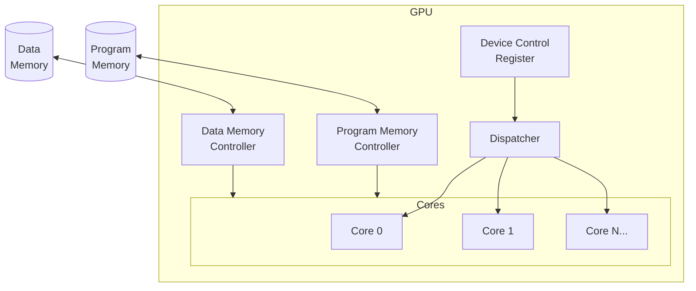
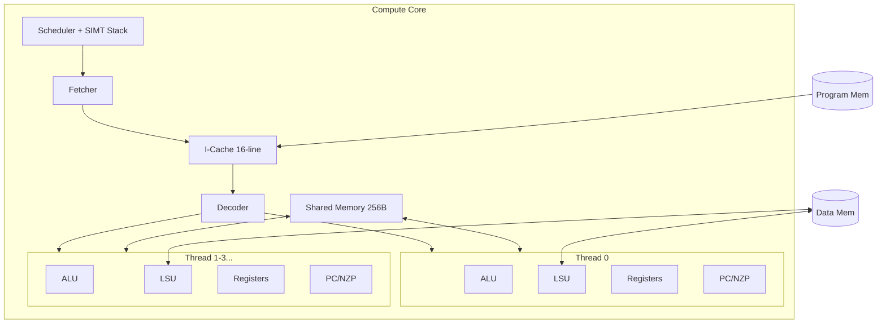

# MiniGPU

A minimal GPU implementation in Verilog optimized for learning about how GPUs work from the ground up developed based on [tiny-gpu](https://github.com/adam-maj/tiny-gpu).

## Features

- **SIMT Execution Model** - Single Instruction, Multiple Threads architecture
- **SIMT Stack** - Hardware support for branch divergence handling with explicit reconvergence
- **Instruction Cache** - 16-line direct-mapped cache for program memory
- **Shared Memory** - Block-level scratchpad memory (256 bytes) with `LDS`/`STS` instructions
- **15 Instructions** - Including arithmetic, memory, control flow, and shared memory operations

Built with fully documented Verilog, complete documentation on architecture & ISA, working matrix addition/multiplication kernels, and full support for kernel simulation & execution traces.

### Table of Contents

- [Architecture](#architecture)
- [ISA](#isa)
- [Execution](#execution)
  - [Core](#core-1)
  - [Thread](#thread)
- [Kernels](#kernels)
  - [Matrix Addition](#matrix-addition)
  - [Matrix Multiplication](/tree/master?tab=readme-ov-file#matrix-multiplication)
- [Simulation](#simulation)
- [Advanced Functionality](#advanced-functionality)
- [Next Steps](#next-steps)

# Architecture

## GPU Overview

## Compute Core

# ISA

MiniGPU implements a 15-instruction ISA with 16-bit fixed-width encoding.

## Instruction Format

| Bits | [15:12] | [11:8] | [7:4] | [3:0] |
|------|---------|--------|-------|-------|
| Field | Opcode | Rd/nzp | Rs | Rt/imm |

## Instruction Encoding

| Opcode | Mnemonic | Semantics | Encoding |
|--------|----------|-----------|----------|
| 0000 | NOP | `PC = PC + 1` | `0000 xxxx xxxx xxxx` |
| 0001 | BRnzp | `if (NZP) PC = IMM8` | `0001 nzp0 iiii iiii` |
| 0010 | CMP | `NZP = sign(Rs - Rt)` | `0010 xxxx ssss tttt` |
| 0011 | ADD | `Rd = Rs + Rt` | `0011 dddd ssss tttt` |
| 0100 | SUB | `Rd = Rs - Rt` | `0100 dddd ssss tttt` |
| 0101 | MUL | `Rd = Rs * Rt` | `0101 dddd ssss tttt` |
| 0110 | DIV | `Rd = Rs / Rt` | `0110 dddd ssss tttt` |
| 0111 | LDR | `Rd = global_mem[Rs]` | `0111 dddd ssss xxxx` |
| 1000 | STR | `global_mem[Rs] = Rt` | `1000 xxxx ssss tttt` |
| 1001 | CONST | `Rd = IMM8` | `1001 dddd iiii iiii` |
| 1010 | JMP | `PC = Rs` | `1010 xxxx ssss xxxx` |
| 1011 | RECONV | SIMT reconvergence | `1011 xxxx xxxx xxxx` |
| 1100 | LDS | `Rd = shared_mem[Rs]` | `1100 dddd ssss xxxx` |
| 1101 | STS | `shared_mem[Rs] = Rt` | `1101 xxxx ssss tttt` |
| 1111 | RET | Thread done | `1111 xxxx xxxx xxxx` |

## Registers

| Index | Name | Description |
|-------|------|-------------|
| 0-12 | R0-R12 | General purpose (read/write) |
| 13 | %blockIdx | Block index (read-only) |
| 14 | %blockDim | Block size (read-only) |
| 15 | %threadIdx | Thread index (read-only) |

# Execution

Each core follows the following control flow going through different stages to execute each instruction:

1. `FETCH` - Fetch the next instruction at current program counter from program memory.
2. `DECODE` - Decode the instruction into control signals.
3. `REQUEST` - Request data from global memory if necessary (if `LDR` or `STR` instruction).
4. `WAIT` - Wait for data from global memory if applicable.
5. `EXECUTE` - Execute any computations on data.
6. `UPDATE` - Update register files and NZP register.

The control flow is laid out like this for the sake of simplicity and understandability.

In practice, several of these steps could be compressed to be optimize processing times, and the GPU could also use **pipelining** to stream and coordinate the execution of many instructions on a cores resources without waiting for previous instructions to finish.

# Kernels

The following test kernels demonstrate various GPU features:

| Test | Description | Key Features |
|------|-------------|--------------|
| `make test_matadd` | Matrix addition (1×8) | SIMD, global memory load/store |
| `make test_matmul` | Matrix multiplication (2×2) | Loops, branching with convergence |
| `make test_divergence` | Branch divergence test | SIMT Stack, `RECONV` instruction |
| `make test_shared_memory` | Shared memory test | `LDS`/`STS` instructions, inter-thread communication |
| `make test_jmp` | Jump instruction test | `JMP` indirect branching |
| `make test_icache` | Instruction cache test | Cache hit/miss behavior |

# Simulation

MiniGPU is setup to simulate the execution of both of the above kernels. Before simulating, you'll need to install [iverilog](https://steveicarus.github.io/iverilog/usage/installation.html) and [cocotb](https://docs.cocotb.org/en/stable/install.html):

- Install Verilog compilers with `brew install icarus-verilog` and `pip3 install cocotb`
- Download the latest version of sv2v from https://github.com/zachjs/sv2v/releases, unzip it and put the binary in $PATH.
- Run `mkdir build` in the root directory of this repository.

Once you've installed the pre-requisites, you can run the kernel simulations with `make test_matadd` and `make test_matmul`.

Executing the simulations will output a log file in `test/logs` with the initial data memory state, complete execution trace of the kernel, and final data memory state.

If you look at the initial data memory state logged at the start of the logfile for each, you should see the two start matrices for the calculation, and in the final data memory at the end of the file you should also see the resultant matrix.

Below is a sample of the execution traces, showing on each cycle the execution of every thread within every core, including the current instruction, PC, register values, states, etc.

# Next Steps

Updates I want to make in the future to improve the design, anyone else is welcome to contribute as well:

- [x] Add a simple cache for instructions
- [x] Add basic branch divergence (SIMT Stack)
- [x] Add shared memory support
- [ ] Add synchronization barriers (`SYNC` instruction)
- [ ] Add basic memory coalescing
- [ ] Add basic pipelining
- [ ] Add warp scheduling for latency hiding
- [ ] Build an adapter to use GPU with Tiny Tapeout
- [ ] Optimize control flow and use of registers to improve cycle time
- [ ] Write a basic graphics kernel or add simple graphics hardware to demonstrate graphics functionality
